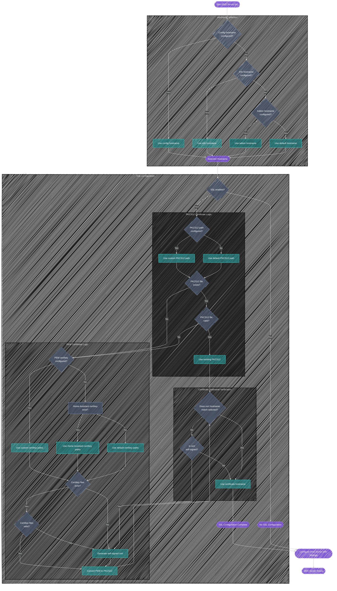

# Init Flowchart

```mermaid
---
config:
  flowchart:
    darkMode: true
    useMaxWidth: true
    curve: monotoneY
    htmlLabels: true
  theme: neo-dark
  look: handDrawn
---
flowchart TD
  %% Classes for consistent styling
  classDef decision fill:#4a5568,stroke:#718096,color:white
  classDef action fill:#2c7a7b,stroke:#38b2ac,color:white
  classDef terminal fill:#805ad5,stroke:#9f7aea,color:white

  %% Entry point
  START([Start DNS Server Init]):::terminal

  %% Hostname Selection Process
  subgraph "Hostname Selection"
    IS_CONFIG_HOSTNAME{"Config hostname<br>configured?"}:::decision
    IS_INFO_HOSTNAME{"Info hostname<br>configured?"}:::decision
    IS_ADDON_HOSTNAME{"Addon hostname<br>configured?"}:::decision

    SET_CONFIG_HOSTNAME["Use config hostname"]:::action
    SET_INFO_HOSTNAME["Use info hostname"]:::action
    SET_ADDON_HOSTNAME["Use addon hostname"]:::action
    SET_DEFAULT_HOSTNAME["Use default hostname"]:::action

    HOSTNAME_RESULT([Selected Hostname]):::terminal
  end

  %% SSL Certificate Selection Process
  subgraph "SSL Configuration"
    IS_SSL_ENABLED{"SSL enabled?"}:::decision

    %% PKCS12 Certificate Path
    subgraph "PKCS12 Certificate Logic"
      IS_PKCS12_PATH{"PKCS12 path<br>configured?"}:::decision
      USE_CUSTOM_PKCS12["Use custom PKCS12 path"]:::action
      USE_DEFAULT_PKCS12["Use default PKCS12 path"]:::action
      CHECK_PKCS12_EXISTS{"PKCS12 file<br>exists?"}:::decision
      VALIDATE_PKCS12{"PKCS12 file<br>valid?"}:::decision
      SET_USE_PKCS12["Use existing PKCS12"]:::action
    end

    %% PEM Certificate Path
    subgraph "PEM Certificate Logic"
      IS_PEM_PATH{"PEM cert/key<br>configured?"}:::decision
      USE_CUSTOM_PEM["Use custom cert/key paths"]:::action
      IS_HA_PEM_PATH["Home Assistant cert/key<br>exist?"]:::decision
      USE_HA_PEM["Use Home Assistant cert/key paths"]:::action
      USE_DEFAULT_PEM["Use default cert/key paths"]:::action
      CHECK_PEM_EXISTS{"Cert/key files<br>exist?"}:::decision
      VALIDATE_PEM{"Cert/key files<br>valid?"}:::decision
      SET_GENERATE_SELF_SIGNED["Generate self-signed cert"]:::action
      SET_GENERATE_PKCS12["Convert PEM to PKCS12"]:::action
    end

    %% Hostname/Certificate Verification
    subgraph "Certificate Hostname Verification"
      IS_HOSTNAME_MATCH{"Does cert hostname<br>match selected?"}:::decision
      IS_CERT_SELF_SIGNED{"Is cert<br>self-signed?"}:::decision
      USE_CERT_HOSTNAME["Use certificate hostname"]:::action
    end

    SSL_RESULT([SSL Configuration Complete]):::terminal
    SKIP_SSL([No SSL Configuration]):::terminal
  end

  %% Final DNS Server Configuration
  DNS_SETUP([Configure DNS Server with Settings]):::terminal
  END([DNS Server Ready]):::terminal

  %% Main Flow Connections
  START --> IS_CONFIG_HOSTNAME

  %% Hostname Selection Flow
  IS_CONFIG_HOSTNAME -->|Yes| SET_CONFIG_HOSTNAME
  IS_CONFIG_HOSTNAME -->|No| IS_INFO_HOSTNAME
  IS_INFO_HOSTNAME -->|Yes| SET_INFO_HOSTNAME
  IS_INFO_HOSTNAME -->|No| IS_ADDON_HOSTNAME
  IS_ADDON_HOSTNAME -->|Yes| SET_ADDON_HOSTNAME
  IS_ADDON_HOSTNAME -->|No| SET_DEFAULT_HOSTNAME

  SET_CONFIG_HOSTNAME --> HOSTNAME_RESULT
  SET_INFO_HOSTNAME --> HOSTNAME_RESULT
  SET_ADDON_HOSTNAME --> HOSTNAME_RESULT
  SET_DEFAULT_HOSTNAME --> HOSTNAME_RESULT

  HOSTNAME_RESULT --> IS_SSL_ENABLED

  %% SSL Configuration Flow
  IS_SSL_ENABLED -->|Yes| IS_PKCS12_PATH
  IS_SSL_ENABLED -->|No| SKIP_SSL

  %% PKCS12 Path Logic
  IS_PKCS12_PATH -->|Yes| USE_CUSTOM_PKCS12
  IS_PKCS12_PATH -->|No| USE_DEFAULT_PKCS12
  USE_CUSTOM_PKCS12 --> CHECK_PKCS12_EXISTS
  USE_DEFAULT_PKCS12 --> CHECK_PKCS12_EXISTS
  CHECK_PKCS12_EXISTS -->|Yes| VALIDATE_PKCS12
  CHECK_PKCS12_EXISTS -->|No| IS_PEM_PATH
  VALIDATE_PKCS12 -->|Yes| SET_USE_PKCS12
  VALIDATE_PKCS12 -->|No| IS_PEM_PATH

  %% PEM Path Logic
  IS_PEM_PATH -->|Yes| USE_CUSTOM_PEM
  IS_PEM_PATH -->|No| IS_HA_PEM_PATH
  IS_HA_PEM_PATH -->|Yes| USE_HA_PEM
  IS_HA_PEM_PATH -->|No| USE_DEFAULT_PEM
  USE_CUSTOM_PEM --> CHECK_PEM_EXISTS
  USE_HA_PEM --> CHECK_PEM_EXISTS
  USE_DEFAULT_PEM --> CHECK_PEM_EXISTS
  CHECK_PEM_EXISTS -->|Yes| VALIDATE_PEM
  VALIDATE_PEM -->|Yes| SET_GENERATE_PKCS12
  VALIDATE_PEM -->|No| SET_GENERATE_SELF_SIGNED
  CHECK_PEM_EXISTS -->|No| SET_GENERATE_SELF_SIGNED

  %% Certificate Processing Flow
  SET_USE_PKCS12 --> IS_HOSTNAME_MATCH
  SET_GENERATE_SELF_SIGNED --> SET_GENERATE_PKCS12
  SET_GENERATE_PKCS12 --> IS_HOSTNAME_MATCH

  IS_CERT_SELF_SIGNED -->|Yes| SET_GENERATE_SELF_SIGNED
  IS_CERT_SELF_SIGNED -->|No| USE_CERT_HOSTNAME
  IS_HOSTNAME_MATCH -->|Yes| USE_CERT_HOSTNAME
  IS_HOSTNAME_MATCH -->|No| IS_CERT_SELF_SIGNED

  USE_CERT_HOSTNAME --> SSL_RESULT

  %% Final Flow
  SSL_RESULT --> DNS_SETUP
  SKIP_SSL --> DNS_SETUP
  DNS_SETUP --> END

```
