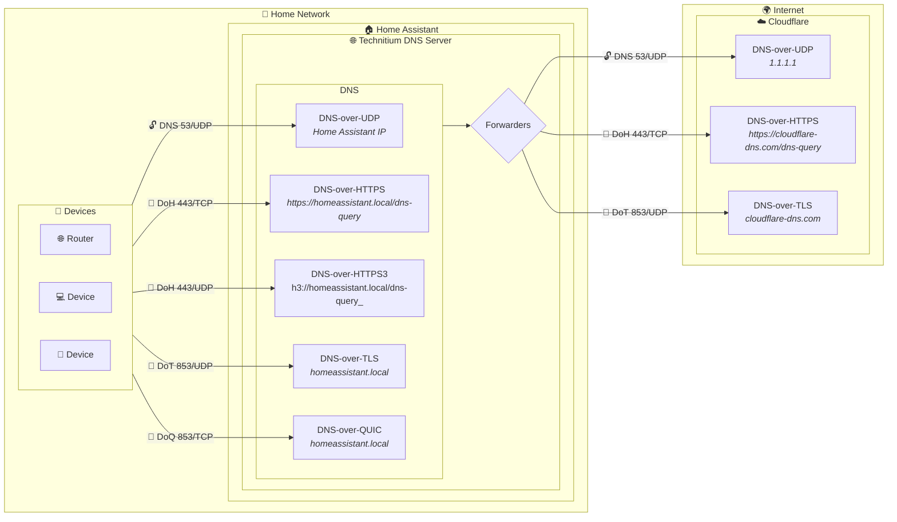

```mermaid
---
config:
  flowchart:
    darkMode: true
    useMaxWidth: true
    curve: monotoneX
    htmlLabels: false
---
flowchart LR
  subgraph Local ["`🏡 Home Network`"]
    subgraph LAN ["`🤖 Devices`"]
      direction LR
      R["`🌐 Router`"]
      D["`💻 Device`"]
      P["`📱 Device`"]
    end
    subgraph HA ["`🏠 Home Assistant`"]
      subgraph AO["`🌐 Technitium DNS Server`"]
        subgraph DNS["`DNS`"]
          DNS53["`DNS-over-UDP
            _Home Assistant IP_`"]
          DNSDoH["`DNS-over-HTTPS
            _https:&sol;&sol;homeassistant.local/dns-query_`"]
          DNSDoH3["`DNS-over-HTTPS3
            h3:&sol;&sol;homeassistant.local/dns-query_`"]
          DNSDoT["`DNS-over-TLS
            _homeassistant.local_`"]
          DNSDoQ["`DNS-over-QUIC
            _homeassistant.local_`"]
        end
        F{"`Forwarders`"}
      end
    end
  end

  subgraph WAN ["`🌍 Internet`"]
    subgraph CF ["`☁️ Cloudflare`"]
      CFS53["`DNS-over-UDP
        _1.1.1.1_`"]
      CFSDoH["`DNS-over-HTTPS
        _https:&sol;&sol;cloudflare-dns.com/dns-query_`"]
      CFSDoT["`DNS-over-TLS
        _cloudflare-dns.com_`"]
    end
  end

  LAN --> |"`🔓 DNS 53/UDP`"| DNS53
  LAN --> |"`🔐 DoH 443/TCP`"| DNSDoH
  LAN --> |"`🔐 DoH 443/UDP`"| DNSDoH3
  LAN --> |"`🔐 DoQ 853/TCP`"| DNSDoQ
  LAN --> |"`🔐 DoT 853/UDP`"| DNSDoT
  DNS --> F
  F --> |"`🔓 DNS 53/UDP`"| CFS53
  F --> |"`🔐 DoH 443/TCP`"| CFSDoH
  F --> |"`🔐 DoT 853/UDP`"| CFSDoT
```
