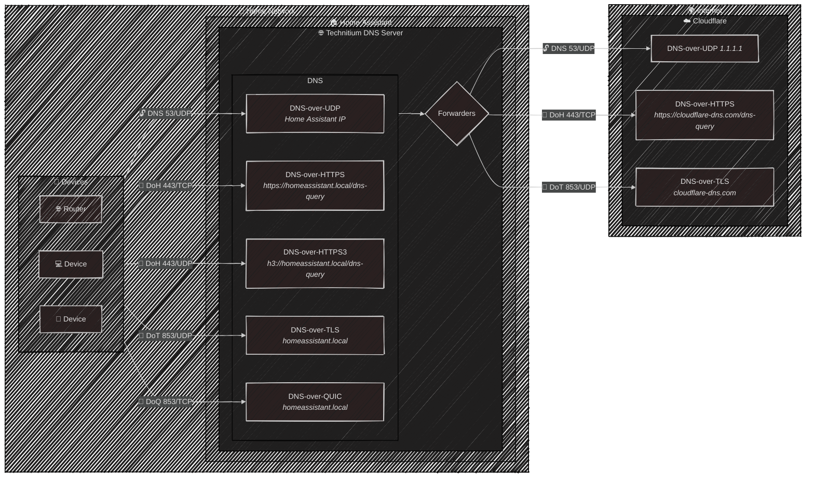

# DNS Flowchart

```mermaid
---
config:
  flowchart:
    darkMode: true
    useMaxWidth: true
    curve: monotoneX
    htmlLabels: true
  theme: neo-dark
  look: handDrawn
---
flowchart LR
  subgraph Local ["`🏡&nbsp;Home&nbsp;Network`"]
    subgraph LAN ["`🤖&nbsp;Devices`"]
      direction LR
      R["`🌐&nbsp;Router`"]
      D["`💻&nbsp;Device`"]
      P["`📱&nbsp;Device`"]
    end
    subgraph HA ["`🏠&nbsp;Home&nbsp;Assistant`"]
      subgraph AO["`🌐&nbsp;Technitium&nbsp;DNS&nbsp;Server`"]
        subgraph DNS["`DNS`"]
          DNS53["`DNS-over-UDP&NewLine;_Home&nbsp;Assistant&nbsp;IP_`"]
          DNSDoH["`DNS-over-HTTPS&NewLine;_https&colon;&sol;&sol;homeassistant&period;local&sol;dns-query_`"]
          DNSDoH3["`DNS-over-HTTPS3&NewLine;_h3&colon;&sol;&sol;homeassistant&period;local&sol;dns-query_`"]
          DNSDoT["`DNS-over-TLS&NewLine;_homeassistant&period;local_`"]
          DNSDoQ["`DNS-over-QUIC&NewLine;_homeassistant&period;local_`"]
        end
        F{"`Forwarders`"}
      end
    end
  end

  subgraph WAN ["`🌍&nbsp;Internet`"]
    subgraph CF ["`☁️&nbsp;Cloudflare`"]
      CFS53["`DNS-over-UDP&NewLine;_1.1.1.1_`"]
      CFSDoH["`DNS-over-HTTPS&NewLine;_https&colon;&sol;&sol;cloudflare-dns&period;com&sol;dns-query_`"]
      CFSDoT["`DNS-over-TLS&NewLine;_cloudflare-dns&period;com_`"]
    end
  end

  LAN --> |"`🔓&nbsp;DNS&nbsp;53&sol;UDP`"| DNS53
  LAN --> |"`🔐&nbsp;DoH&nbsp;443&sol;TCP`"| DNSDoH
  LAN --> |"`🔐&nbsp;DoH&nbsp;443&sol;UDP`"| DNSDoH3
  LAN --> |"`🔐&nbsp;DoQ&nbsp;853&sol;TCP`"| DNSDoQ
  LAN --> |"`🔐&nbsp;DoT&nbsp;853&sol;UDP`"| DNSDoT
  DNS --> F
  F --> |"`🔓&nbsp;DNS&nbsp;53&sol;UDP`"| CFS53
  F --> |"`🔐&nbsp;DoH&nbsp;443&sol;TCP`"| CFSDoH
  F --> |"`🔐&nbsp;DoT&nbsp;853&sol;UDP`"| CFSDoT
```
